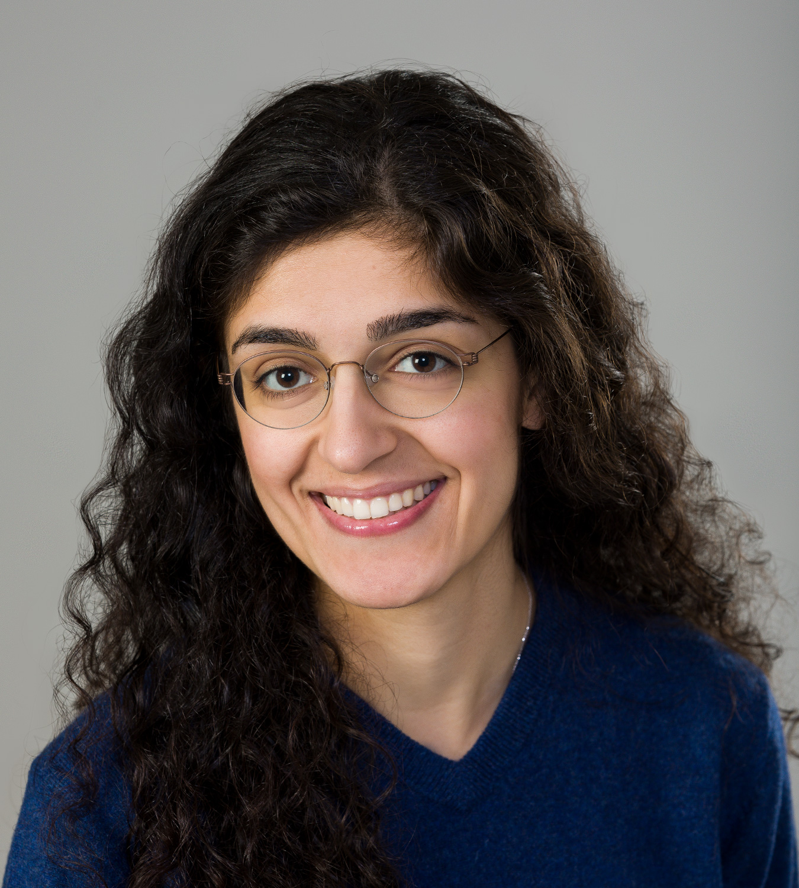
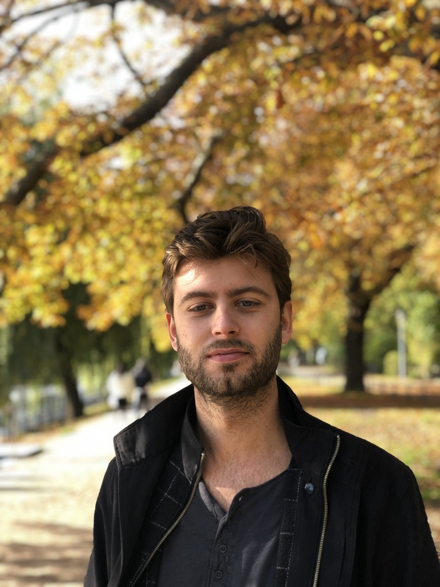
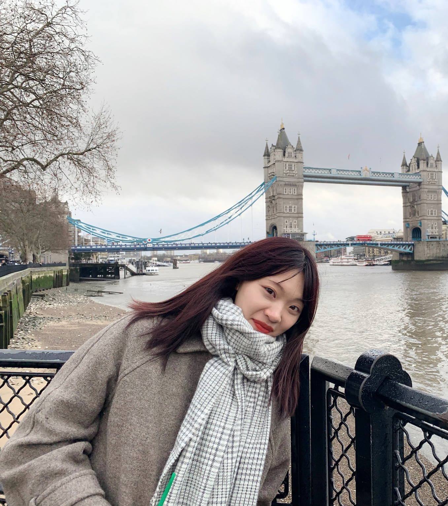
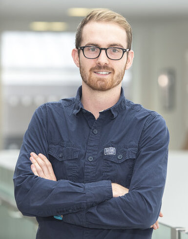
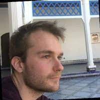
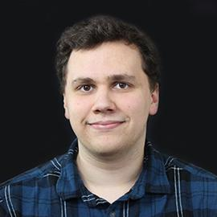

<!-- <strong>Ava Khamseh:</strong> Group Leader & Lecturer in Biomedical Artifical Intelligence, [Institute of Genetics & Cancer][1] (IGC) and the [School of Informatics][2]  -->

<table>
  <tr>
    <td> </td>

    <td><strong>Ava Khamseh:</strong> Group Leader   Lecturer in Biomedical Artificial Intelligence   Institute of Genetics & Cancer (IGC)  School of Informatics, Edinburgh University</td>
   </tr> 
   <tr>
      <td></td>

      <td><strong>Abel Jansma:</strong> PhD student, jointy supervised with    Chris Ponting (IGC, primary supervisor) and   Luigi Del Debbio (School of Physics)   In my research, I think about genetic interactions.   We usually think about interactions between two genes,   but what does an interaction between three genes look like?   Do these higher-order interactions affect the behaviour of cells?   I try to answer these questions by combining intuition from physics,   knowledge from biology, and techniques from mathematics. </td>
  </tr>
     <tr>
      <td></td>

      <td><strong>Yuelin Yao</strong>: PhD student (SoI)</td>
  </tr> 
  <tr>
      <td></td>

      <td><strong>Ed Jarman</strong>: Research Fellow (MRC HGU, CRUK)</td>
  </tr>     
  <tr>
      <td></td>

      <td><strong>Stephanie MacMaster</strong>: Research Assistant (MRC HGU)</td>
  </tr>
   <tr>
      <td></td>

      <td><strong>Kelsey Tetley-Campbell</strong>: PhD student (MRC HGU)</td>
  </tr>
   <tr>
      <td></td>

      <td><strong>Olivier Labayle Pabet</strong>: Biomedical AI PhD student (SoI)</td>
  </tr>
   <tr>
      <td></td>

      <td><strong>Hugh Warden</strong>: PhD student (MRC HGU)</td>
  </tr>
   <tr>
      <td></td>

      <td><strong>Shuyang Wu</strong>: MSc student  Detecting oncogenic mutations and morphological changes in histology images of early cancer via machine learning</td>
  </tr>
   <tr>
      <td></td>

      <td><strong>Varsha Kesavan</strong>: MSc student   Investigating synthetically generated single cell RNA-sequencing data via generative networks </td>
  </tr>
   <tr>
      <td></td>

      <td><strong>Vidhyah Ganesharaja</strong>: MSc student   Trajectory inference of cellular morphologies for drug discovery</td>

  </tr>
</table>

 [1]: https://www.ed.ac.uk/institute-genetics-cancer
 [2]: https://www.ed.ac.uk/informatics